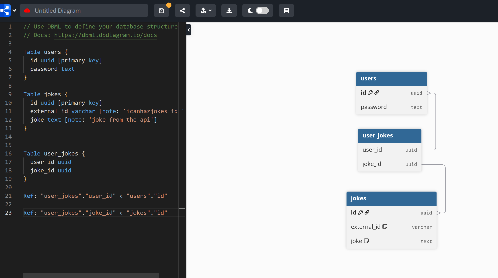

## Research Spike
The goal of this research spike is to learn more about:
- **Webapp to Database Connection Questions**
    - How to parse the jokes returned by the API 
    - How to save jokes to the database
        -  To connect the database to our express application, we'll need to provide the credentials so our web framework can access the database and make queries.
- **Database Structure Questions**
    - How to structure the tables within the database
        - 
    - How to associate jokes with users
        - We'll create a join table that just has the user_id and the joke_id and that equals a unique row. 
    - What data and datatypes should be used in our tables? 
        - I'm thinking mostly text and uuids at this point. We could save the time that the joke was saved, but that can be something to do later
    - Should the original joke id from icanhazdadjoke be used, or another id? 
        - We'll use our own generated uuid, but save the icanhazdadjoke id for later in our database. This is so just in case they change the id system in the future we won't be affected. 
- **Authentication Questions**
    - How to save a user and their password so they can login
        - The way we can do this is using passport.js where we use a local strategy to set up a username and password within our database. 
    - How to return jokes from the database to a specific user
        - We'd use the join table, HOWEVER, a question is if there's a limit on how many jokes a user will see at once (like if they saved 50 jokes, should all 50 be returned at once?)
    - How will we address user roles? 
